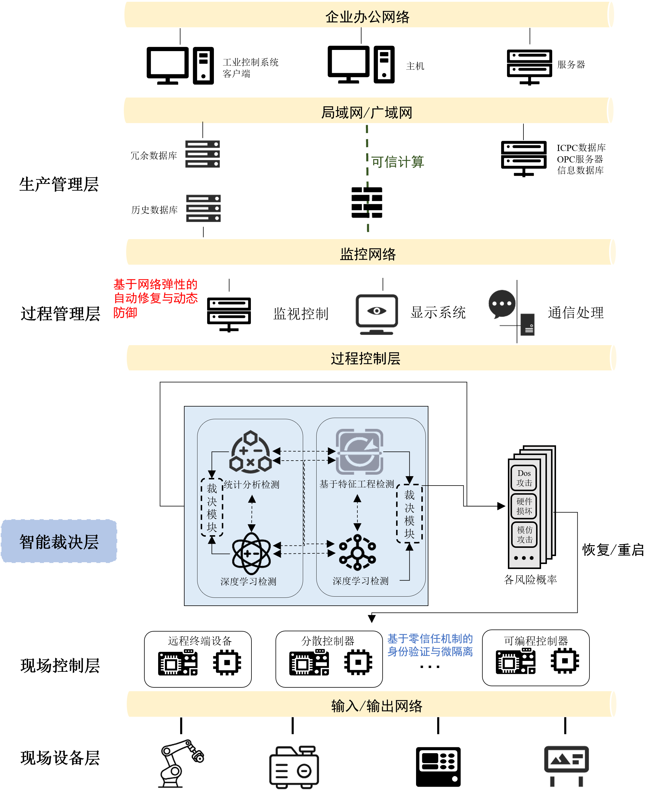
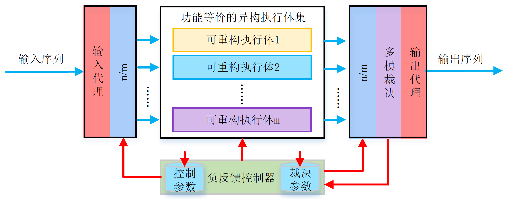
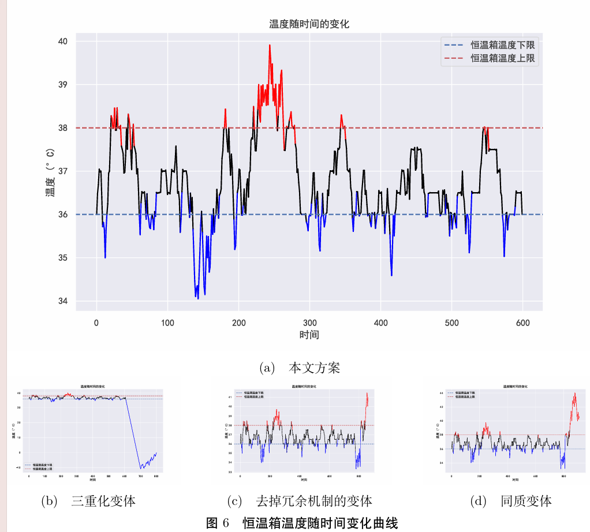

# QHRSCS：可防御漏洞攻击的四重化动态异构冗余分布式工业控制器架构
### 摘要

随着工业控制系统复杂性和网络信息安全威胁的加剧，确保系统的可靠性和稳定性变得愈加重要。
传统主动防御技术旨在通过额外添加模块防御攻击，但这些模块本身的安全问题就值得商榷，如拜占庭容错架构难以抵御同质漏洞攻击，移动目标防御也无法应对主动后门攻击。
针对这些局限，网络空间内生安全从内在功能防护的角度出发，利用动态异构冗余、广义鲁棒控制机制等理念，实现对协同故障的强抑制，从而达到“高可靠、高可信、高可用”的内生安全功能。
基于此，本文提出了一种可防御漏洞攻击的四重化动态异构冗余分布式工业控制器架构（Quadruplicated Heterogeneous Redundant Security Control System，QHRSCS），以应对动态变化的外部攻击和潜在的内在故障。
QHRSCS 首先监测各分布式控制器系统（DCS）的安全状态并发送攻击请求，若检测到 DCS 模块在线且检测概率有效，则视为成功防御攻击，
QHRSCS 随后分析 DCS 返回的检测结果，将检测概率转化为攻击类型并与预期匹配，成功识别后记录攻击事件；
如果模块离线，系统则触发冗余切换，将负载转移至备用模块，并动态将故障模块调整为备用控制器，以确保系统的稳健性和可恢复性。
QHRSCS通过在线监测、冗余切换及攻击响应提升系统的稳态可用性，从而为工业控制系统提供智能化安全防护。
为了贴合真实场景，本文构建了恒温箱作为真实工业控制场景，模拟不同攻击场景下的系统行为，验证了 DHR 架构在提高系统安全性和稳定性方面的有效性。
实验结果表明，QHRSCS架构在稳态可用性、平均无故障工作时间、平均恢复时间系统架构弹性等指标上均超过同类的防御方法。
最后，本文还从控制论、信息论和博弈论等理论角度论证了QHRSCS的安全性。

### 简要介绍

本项目仿真了四重冗余分布式工业控制器的过程，并通过**真实应用场景**（恒温箱）统计理论与实际防御指标。

### 系统架构图



具体而言，我们采用了 DHR 架构作为主要思路。


### 文件树结构

本项目主要实现基于`python`和`Docker`。

```
DCS_simulator
│── docker-compose.yml  # 多docker启动脚本
│── Dockerfile.DCS1  # DCS1的Dockerfile，下同
│── Dockerfile.DCS2
│── Dockerfile.DCS3
│── Dockerfile.Incubator  # 恒温箱的Dockerfile
│── Dockerfile.RedundantPLC
│── figure  # 论文中的图
│   │── temperature_data.csv  # 绘制图片会用到的数据
│   │── temperature_variation_0.pdf
│   │── temperature_variation_1.pdf
│   │── temperature_variation_2.pdf
│   └── temperature_variation_3.pdf
│── figure.ipynb  # 绘制图的代码
│── ics_security
│   └── plc_simulator.py  # DCS控制器仿真代码
│── incubator_simulation.py  # 恒温箱仿真代码
│── main_controller.py  # 主控制器进程
│── README.md
└── 设计安全比赛论文_仿真报告.pdf
```

### 快速开始
确保有 `Docker` 和 `Python` 环境之后，运行：

```
docker-compose up --build
```

然后同时运行主程序脚本：

```
python main_controller.py
```


### 实验效果

